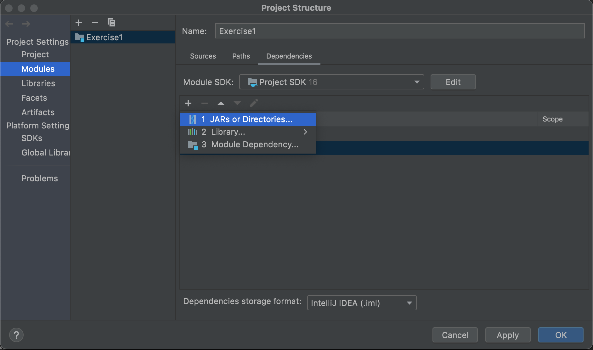

# Язык Java (Магистратура, 1 курс)

## Лабораторная работа № 1

Для выполнения лабораторной работы Вам необходимо установить интегрированную среду разработки IntelliJ IDEA и OpenJDK.
Воспользуйтесь для этого инструкциями, приведенными в Лекции № 1.

### Задание 1: Создание Github-репозитория

В этом задании Вы создадите свой собственный Git-репозиторий на Github. Он будет использоваться во всех практических занятиях данного курса для проверки заданий. Воспользуйтесь для этого инструкциями, указанными [здесь](https://github.com/perevos/java-master/wiki/%D0%A1%D0%B4%D0%B0%D1%87%D0%B0-%D0%B8%D0%BD%D0%B4%D0%B8%D0%B2%D0%B8%D0%B4%D1%83%D0%B0%D0%BB%D1%8C%D0%BD%D1%8B%D1%85-%D0%BF%D1%80%D0%B0%D0%BA%D1%82%D0%B8%D1%87%D0%B5%D1%81%D0%BA%D0%B8%D1%85-%D1%80%D0%B0%D0%B1%D0%BE%D1%82).

1. Зарегистрируйтесь на Github.
2. Создайте Git-репозиторий.
3. Предоставьте преподавателю права доступа к репозиторию.
4. Сделайте клон репозитория в IntelliJ для локальной работы.
5. Создайте ветку lab1.
6. Создайте папку ```lab1``` в репозитории.

### Задание 2: Знакомство с содержимым JAR-файла

В качестве примера мы рассмотрим JAR-файл для проекта [Guava](https://github.com/google/guava). Guava представляет собой коллекцию базовых библиотек для Java, разработанных Google.

1. Скачайте [JAR-архив](https://repo1.maven.org/maven2/com/google/guava/guava/30.1.1-jre/guava-30.1.1-jre.jar) для Guava.
2. Создайте в папке ```lab1``` в Вашем репозитории файл ```guava-content.txt``` и запишите в него список всех файлов, находящихся в JAR-архиве.
   Указание: для вывода списка всех файлов можно воспользоваться командой ```jar tf <имя jar-файла>```. 
3. Манифест JAR-архива находится в файле ```META-INF/MANIFEST.MF```. Найдите в манифесте информацию о версии JDK, использованную для сборки JAR-архива. Создайте в папке ```lab1``` файл ```guava-jdk-version.txt``` и запишите в него найденную версию JDK.

### Задание 3: Импорт зависимостей в Java

1. Создайте в IntelliJ IDEA новое приложение командной строки (Command Line App)
   * Имя проекта: Exercise1
   * Базовый пакет: ```ru.bfu.ipmit.<Ваше имя>```. Пример: ```ru.bfu.ipmit.vitaly```
2. В теле главного метода ```main``` вставьте следующие строки кода:
```java
String greeting = "Hello, <your name>!";
String sha256hex = Hashing.sha256()
    .hashString(greeting, StandardCharsets.UTF_8)
    .toString();
System.out.println(sha256hex);
```
Замените ```<your name>``` на Ваше имя. Пример: ```Виталий```.
1. Ваша программа должна хешировать строку ```greeting``` и выводить результат в консоль.
2. Ваша программа не скомпилируется, так как классы ```Hashing``` и ```StandardCharsets``` не импортированы.
3. Импортируйте класс ```Hashing``` из JAR-архива Guava из Задания 2.
   * Импортируйте в Вашу программу JAR-архив Guava, скачанный в Задании 2. В IntelliJ IDEA выберите File -> Project Structure. Добавьте JAR-архив, как показано на следующем скриншоте.
   
   * В главном файле ```Main.java``` Вашей программы импортируйте класс ```Hashing``` из добавленной Вами библиотеки Guava.
4. Импортируйте класс ```StandardCharsets``` из OpenJDK.
5. Запустите программу. Создайте в папке ```lab1``` Вашего репозитория файл ```hashing.txt``` и запишите в него строку, выведенную в консоль.

### Сдача работы на проверку

1. Убедитесь, что в локальной копии Вашего Git-репозитория Вы находитесь на ветке ```lab1```, и в папке ```lab1``` содержатся следующие файлы:
   * ```guava-content.txt```
   * ```guava-jdk-version.txt```
   * ```hashing.txt```
2. [Создайте Pull Request](https://github.com/perevos/java-master/wiki/%D0%A1%D0%B4%D0%B0%D1%87%D0%B0-%D0%B8%D0%BD%D0%B4%D0%B8%D0%B2%D0%B8%D0%B4%D1%83%D0%B0%D0%BB%D1%8C%D0%BD%D1%8B%D1%85-%D0%BF%D1%80%D0%B0%D0%BA%D1%82%D0%B8%D1%87%D0%B5%D1%81%D0%BA%D0%B8%D1%85-%D1%80%D0%B0%D0%B1%D0%BE%D1%82).